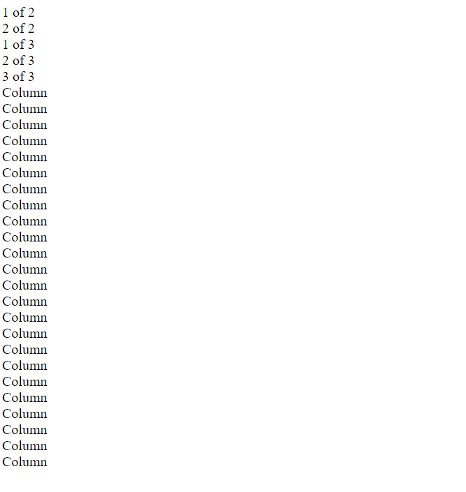
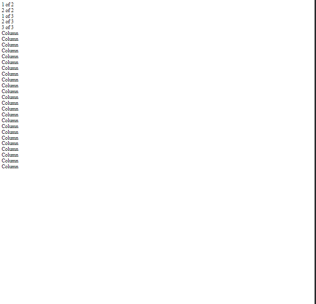
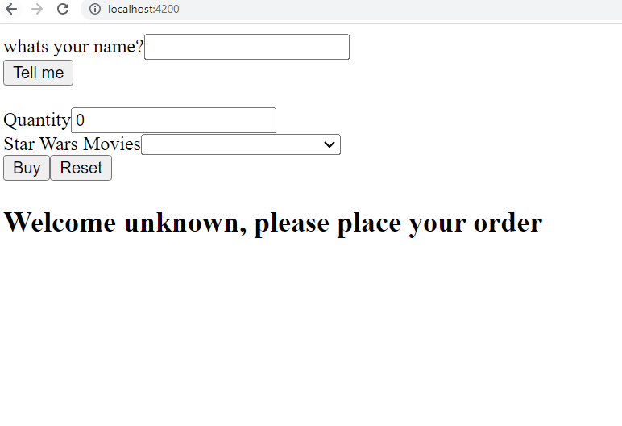
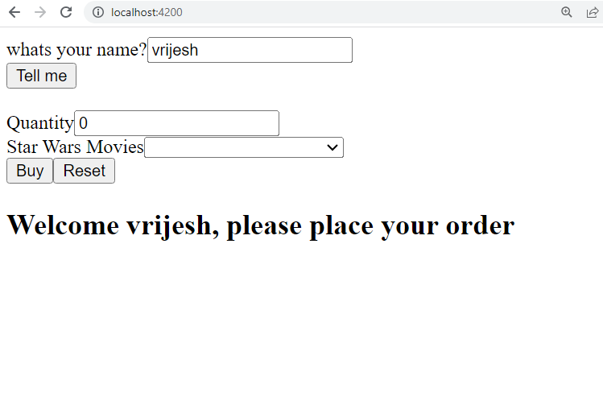
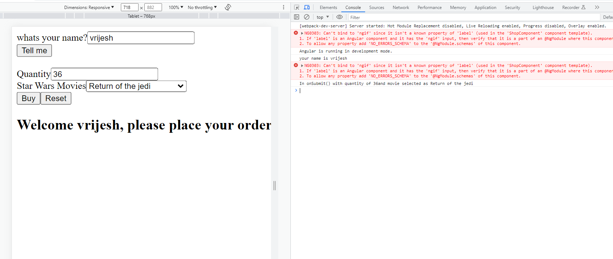

# Activity 3 Part 1
# Vrijesh Patel
###  In this activity I have built simple Angular App that takes basic input from user and provides ouput in the console.log and on the web page.

   
   
   
   

1. Two screenshots, small screen and large, to demo the responsive grid

   
2. Initial screenshot, before name is entered
   
3. Screenshot after the name is entered.
   
   
4. Screenshot of browser with dev tools with quantity and product. On the 'Buy Button'
   
   ## Research Questions 
   1. The @Input decorator in info.component.ts marks a property as an input, allowing values to be passed into the component from its parent component.
   2. The [value] attribute in info.component.html is used to bind the value of an option in a select element to a property or expression in the component's code.
   3. The [(ngModel)] directive in info.component.html enables two-way data binding, allowing the value of an input field to be synchronized between the component's code and the view.
