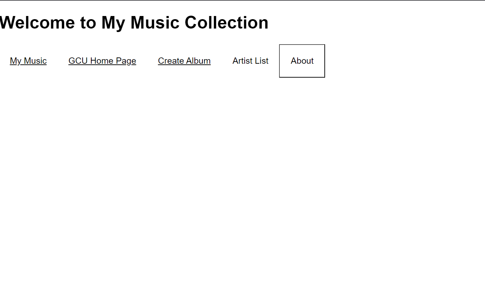
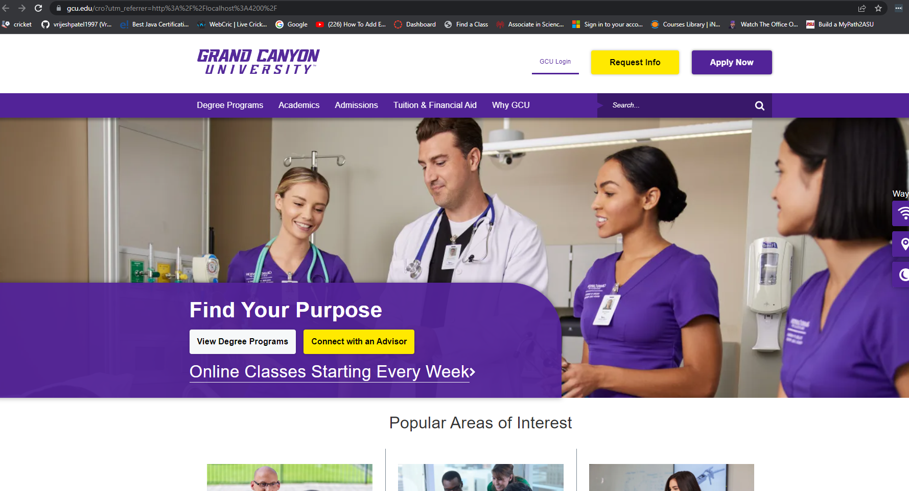

# Activity 3 Part 2
# Vrijesh Patel
###  In this activity I have built Music  Angular App that takes basic input from user and Creates an album ouput in the console.log and on the web page.

   
   
   
   

1. The initial application page

   
2. GCU homepage
   
3. This Screenshot  represents an Angular template for a form that allows users to submit album details, such as artist name, album title, description, year, image filename, and tracks.
   
   
4.  Upon submission, it displays a success message.Create Album page

 

  5. This code represents an Angular template that displays a list of artists as buttons. When a button is clicked, it sets the selectedArtist variable and displays a component that lists albums by the selected artist.

6. This code represents an Angular template that displays a list of albums as buttons. Each button includes the album's image, title, and year. When an album button is clicked, it sets the selectedAlbum variable and displays a component that shows detailed information about the selected album.

7. 
This code represents an alert that displays what version  of the app is user currently using.
