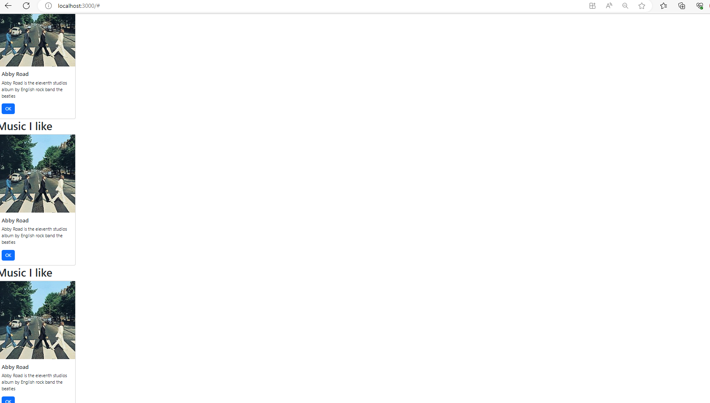
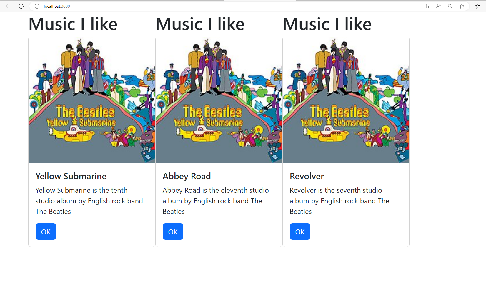
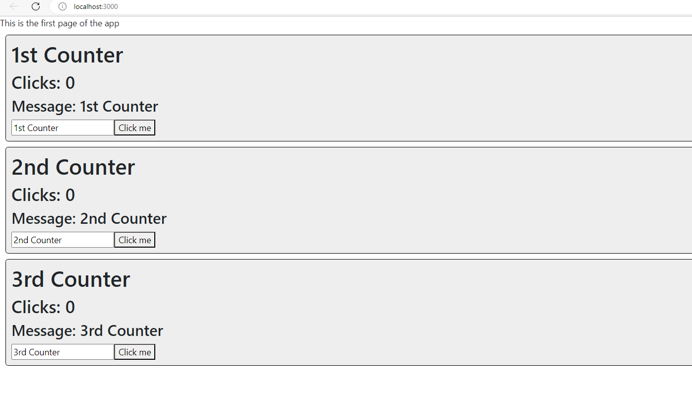
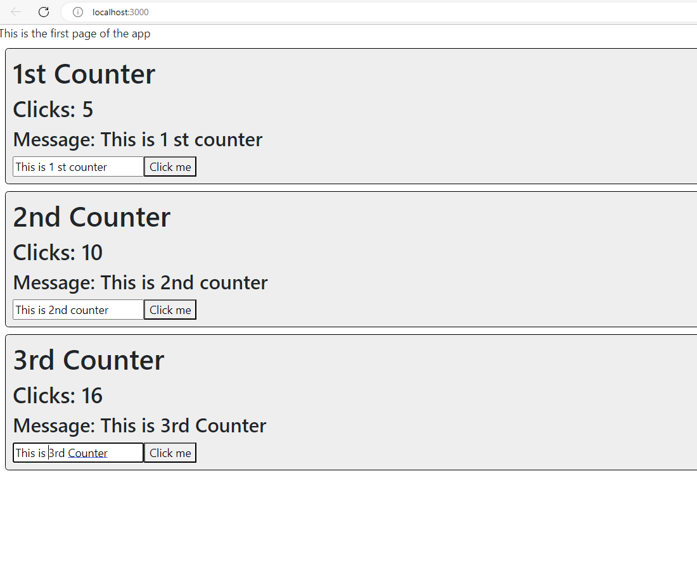

# Activity 5 
# Vrijesh Patel
# Simple React app that displays a list of Beatles albums with album details and cover images using React.

1. The initial application page. 

   

2. The Application after changes made to App.js
 

 ###  This project is a simple React web application that displays a list of albums by The Beatles. It uses the `useState` hook to manage the album data, and it renders each album as a card using the `Card` component. The cards show the album title, description, and a button. When the app is rendered, it displays the list of Beatles albums with their respective details and album cover images.
---------------------------------------------------------------------------------------------------------------------------------------------------------------------------------

 # Activity 5 Part 2 
 # This project displays three interactive counters with click tracking and customizable messages using React components and state management.
3. The initial application page for counter App.
     

4. Adding custom messages and clicks in the counter app
      

      ### This project is a simple React app that displays a webpage with three independent counters. Each counter component maintains its own state using the `useState` hook. When the "Click me" button is clicked for any counter, the corresponding counter's click count increments, and the input field allows users to set a custom message associated with that counter. The page shows the title of each counter, the number of clicks, and the custom message. It demonstrates how to use React components, state management, and event handling to create interactive elements in a web application.
