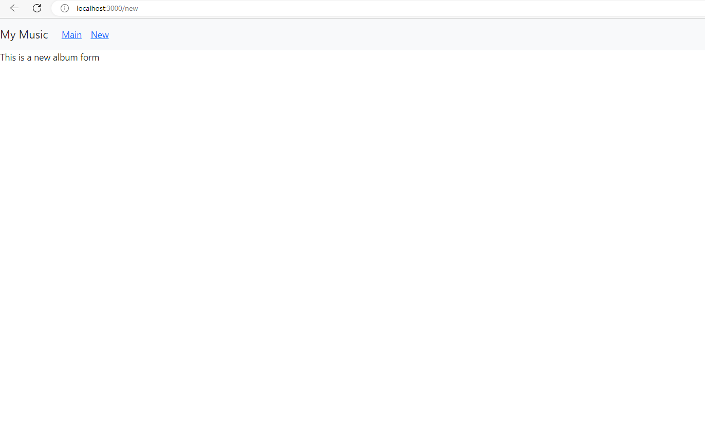

# Activity 6 
# Vrijesh Patel
# Simple React app that displays a list of Beatles albums with album details and cover images using React.

1. The initial application page. 

   

2. The Application after changes made to App.js
 

1. Adding Search component in app.js
    )

2. Activating onsubmit method for search box 
      

3. Searching card by its name 
     

 ###  This React app, fetches data from the local JSON file named "album.json" using the Axios library. It displays a list of albums and their details, such as title, description, and image, in a card format. The app also includes a search functionality where users can enter a search term, and the album list will be filtered dynamically to show only the albums that match the search phrase. The "SearchForm" component handles the user input and triggers the filtering process. The app uses useEffect to load the albums on component mount and useState to manage searchPhrase and albumList state..

 ---
 ---
---
# Activity 6 PART 2
# Vrijesh Patel
# Simple React app with routing, NavBar, login, private routes, and user pages for friends' names.

1. The initial application page. 

   

2. The about page that shows information about company
    
3. The contact us page that shows contact us page and address and contact information
      
4. The Login page that greets user with their name

      

     ### This React app is a feature-rich web application that showcases the power of modern front-end development. With a seamless multi-page experience enabled by React's routing system, users can effortlessly navigate through the app. A visually appealing and responsive NavBar offers easy access to essential sections like "About," "Contact us," "User," and "Login." The implementation of private routes ensures secure access to protected pages only for authenticated users. The login page facilitates a safe and user-friendly login process. Moreover, the app provides personalized user pages by dynamically rendering content based on selected links from a list of friends' names, creating a warm and interactive user experience. Overall, the app boasts robust functionality, user-friendly features, and elegant design, appealing to both public and authenticated users.

     
 ---
 ---
---
# Activity 6 PART 3
# Vrijesh Patel
# Simple React app that displays a list of Beatles albums with album details and cover images using React.

1. The updated UI of the music app

   

2. Search for specific word from the list
 

3. Added new section to the navbar where the new album will be added
    
